# Senator Vote Prediction 
### Using Bills and Vote History to Predict Allegiance

The app created to explore this model can be found at https://senator-prediction.jeremytraberowens.com. 

For cost-effectiveness, 
the Sagemaker backend may not always be running, but the comparison of the model against older bills can always be
explored. Should you like to explore how the model behaves for proposed, as yet unseen bills, please email 
jeremy [at] jeremytraberowens [dot] com to turn the service on.

## Introduction

The goal of this project was multi-fold. From a curiosity standpoint, I'm most interested in politics and civic tech, 
and I wanted to know if ML could help people predict how the votes on a given bill would swing in Congress, as those 
laws have vast repercussions throughout our entire country (the USA in my case).

From a technical standpoint, while I was confident in my abilities as it comes to data exploration, analysis, and 
building predictive models, I specifically wanted to learn more about natural language processing (NLP) in the world of 
data science, and how to implement it in machine learning algorithms. I also wanted to grow my skills in creating apps 
that people can use to explore and utilize my model, as well as how to use containers (Docker) and hosting services 
(AWS) to make sure the application is seamless across all environments.

While this app that I developed is fun for citizens and policymakers to use, seeing how various bills they devise could 
fare on the floor of the Senate, this is a product most geared towards the majority and minority whip of the Senate. This
app could certainly be expanded to work in both houses of Congress, but I decided to focus on the Senate for this 
venture. One, the data would be more manageable for an MVP (only 100 senators compared to 435 house seats, which
multiplied across all the bills that hit the floor is a significant difference). Two, senators serve a longer term 
(6 years vs. 2 years), so the model would likely pick up on trends for a particular senator across bills easier than 
house congresspeople, who (potentially) rotate out every 2 years.

## 01 - Data Acquisition

congress 113-116 - why

voteview votes
voteview members
voteview rollcalls

open secrets - future use for bringing in campaign donation info into votes
was able to create a table of CID, FecCandID, BioguideID, Name CSV for senators that did not yet exist on internet

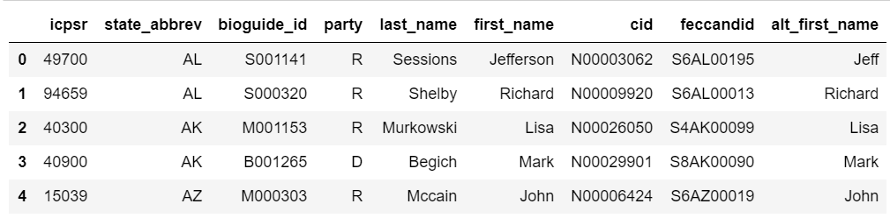

pull all open secrets data, but Remaining ids are for senators who were appointed due to an elected senator's death, 
or left shortly after winning due to scandal.

propublica api - gather bill summaries, subjects list, and amendments from initial bill (ignore treaty documents, not
relevant to this project)

remaining missing bills are those that are the National Defense Authorization Act yearly fiscal bills

## 02 - DF construction and Feature Engineering

making all dataframes from gathered data

join all votes from congress 113 - 116 (dropping those of the vice president, adds unnecessary noise to model)

join all senators from congress 113-116
    drop pres/vice-pres
    change the party code to a readable letter
    separate out name parts for easier joining of dataframes later

join with votes df and add column for the lead party for each congress

join all the rollcalls from each congress together

join to votes/members dataframe

pull out nomination and treaty votes (to reduce model noise)

using fancy table, added cid info to each row in the df (though not currently in use)

created df of major industries that contributed to each senator, but did not incorporate into final model

parse resultant df for all bill numbers, search pro-pub summaries and subjects
parse bill info (summary and cosponsors) into dict from 'summary' pro-pub json
parse party cosponsor count into dict
parse all subjects (if any) into string of all subjects
    #add the subjects string to the dictionary
add the full dictionary to a list of all bills

add all bill info to the votes, members, rollcalls, ids df

add industry info for each senator to the main df
    we create feature for what campaign year relates to congress number, since they are not aligned

make df for election data back to 1976
reduce election df to just those who won each election
fix Lisa Murkowski's nan value for the 2010 election
clean up party affiliations
parse out first and last names
calc how close the race was
make a df for each time someone one their first election by dropping duplicates, keeping their first win
merge the first year elected back onto election df

make the main dataframe by merging election data with all other info (votes, members, ids, etc.)

create feature for if it's an election year
senator's tenure in office (since they first joined)
senator's age
if they're a sponsor of a given bill
whether or not the sponsor of the bill is the lead party in the senate
percentage of cosponsors from a given party on a bill
what is the percentage of cosponsors from the lead party
is the sponsor the same party as the given senator
make interaction of party with cosponsors of that party
exponentiate cosponsor values

dummy variable party and sponsor_party columns
dummy variable lead party designation
drop anywhere df lacks sponsor info
drop any cast codes that are present or absent, and change cast code 6 ('nay') to 0

pickle for baseline and advanced ML modeling

## 03 - Baseline Model

Drop all rollcalls except last for each bill (to make sure hard fought bills aren't oversampled in dataset)
** check with Christophe on this

TTS .3
run non-text data through standard scalar
SMOTE imbalanced dataset (far more nays than yeas)

run recursive feature engineering on dataset (assuming logit reg model)

fit/predict logit model
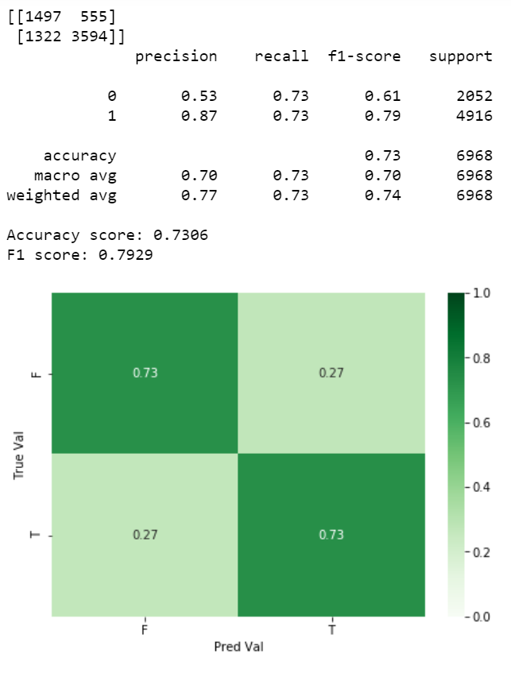
roc-auc score
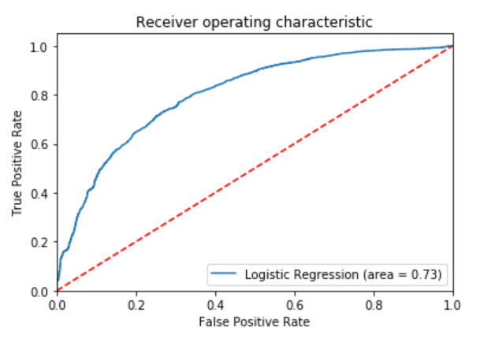

Random Forest
TTS .3, scale, smote

fit/predict logit model
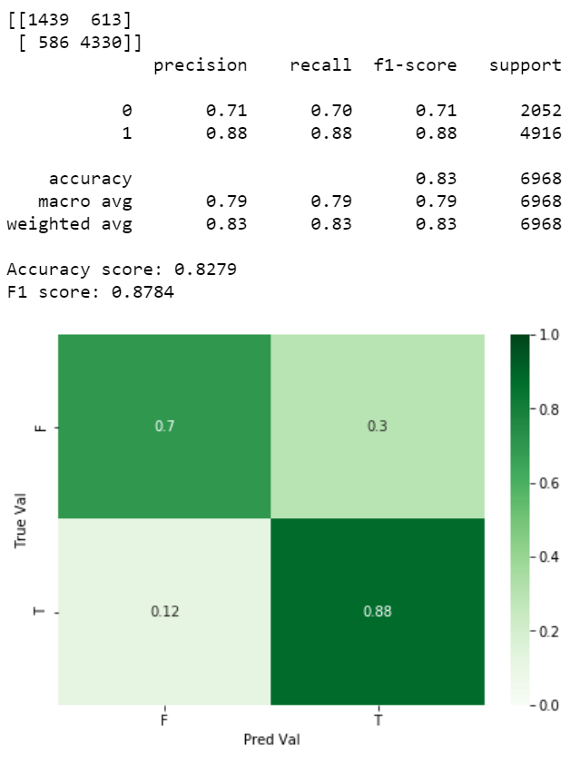
roc-auc score
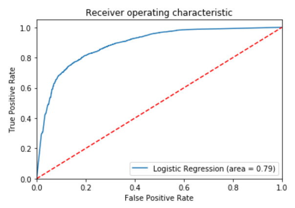

improvement, but want to make sure it's apples to apples comparison for two baselines

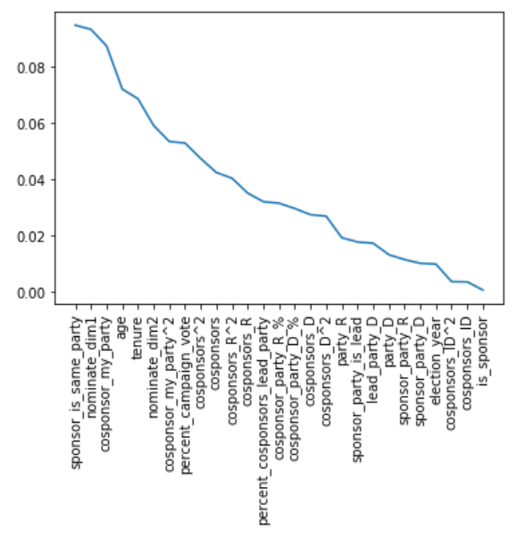

iterated through logit using more and more features (in order of rf importance)

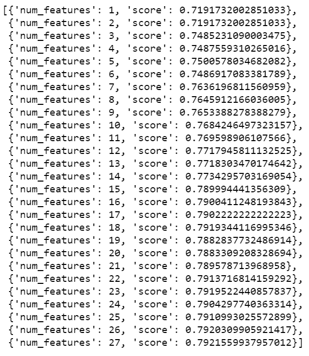

chose 18 features for reasons, re-ran logit with same TTS .3, scale, smote


roc-auc score
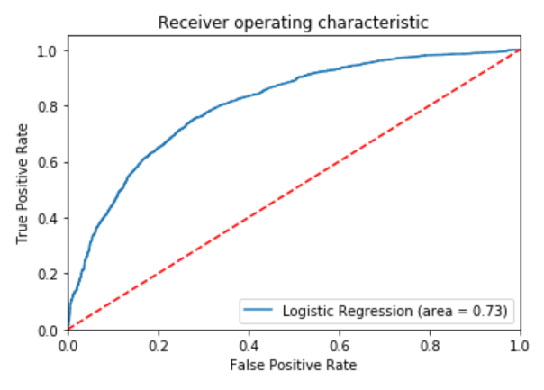

No real change, but saved 18 chosen features for use in more advanced model


## 04 - XGBoost Model

drop all rollcalls except last, and use top 18 features from logit/RF

originally just randomly sampled all data, but later determined that randomly separating out individual bills would
ensure no information from my training environment leaked into my test environment

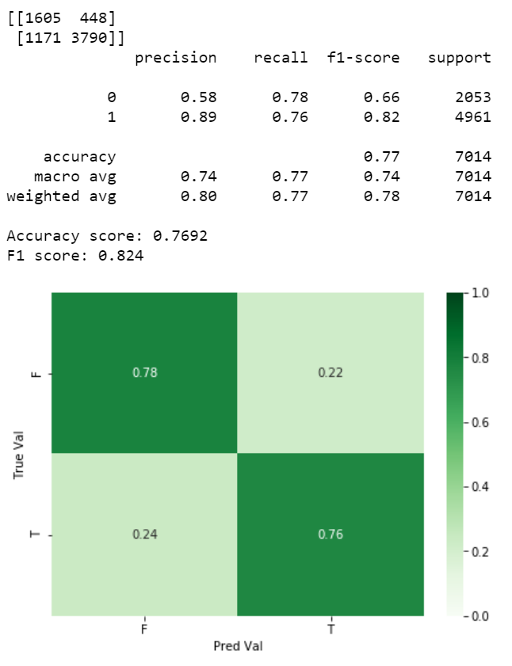

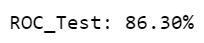

slight improvement, but no major change from logit model
better performance in classifying false values, worse in predicting true values, though an overall improved ROC
score (7%)

### XGB with NLP

Utilize the Universal Sentence Encoder from google to vectorize bills summaries

Turn the embeddings into df, join back with original bill summaries, join back to main_df, oversample training set

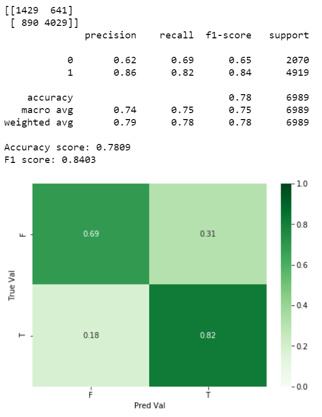

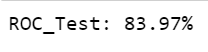

Incorporation of text appears to improve the F1 score, but slightly decrease the ROC score. Suggests that while the
model improves at the rounded binary classification of a yea or nea vote, those votes it predicts incorrectly it
predicts more confidently in the opposite direction.

### Hyperparameter Tuning

The final thing I did with the XGBoost model is some hyperparameter tuning, see what additional shifts we can make to 
eek out the last of that F1 score. I performed a nested iteration through 'n_estimators', 'max_depth', 'learning_rate', 
'subsample', 'colsample_bytree', and 'gamma'. 

```python
n_estimators = [100, 500, 1000]
max_depth = [3, 4, 5, 6]
learning_rate = [.1, .01]
subsample = [.8, .9, 1]
colsample_bytree = [.3, .6, .9]
gamma = [0, 1, 5]
```

```python
for a in n_estimators:
    for b in max_depth:
        for c in learning_rate:
            for d in subsample:
                for e in colsample_bytree:
                    for f in gamma:
                        try:
                            clf_xgb = xgb.sklearn.XGBClassifier(nthread=-1, seed=1234, 
                                                                learning_rate=c,
                                                                n_estimators=a,
                                                                max_depth=b,
                                                                min_child_weight=1,
                                                                gamma=f,
                                                                subsample=d,
                                                                colsample_bytree=e,
                                                                objective= 'binary:logistic',
                                                                scale_pos_weight=1)

                            clf_xgb.fit(X_over_vec[model_cols], y_over)
```

Believe me, I hated writing that many nested loops as you do reading it.

I then plotted the f1 score against the roc score and from all those iterations, I visually chose the hyperparameter 
sets with the highest F1 score, the one with the highest ROC score, and one that was a balance between the two.

I then tested each of those hyperparameter sets using the same oversampled, nlp-included train and test sets as before, 
and chose the one with the highest F1 score, as the ROC was basically the same between all 3 models,as you can see
below.

```python
{'n_estimators': 1000, 
 'max_depth': 6, 
 'learning_rate': 0.1, 
 'subsample': 1, 
 'colsample_bytree': 0.9, 
 'gamma': 0, ...}
F1:  0.8685
ROC: 0.853

{'n_estimators': 500, 
 'max_depth': 6, 
 'learning_rate': 0.1, 
 'subsample': 1, 
 'colsample_bytree': 0.9, 
 'gamma': 0, ...}
F1:  0.8655
ROC: 0.8542

{'n_estimators': 1000, 
 'max_depth': 5, 
 'learning_rate': 0.1, 
 'subsample': 0.9, 
 'colsample_bytree': 0.3, 
 'gamma': 1, ...}
F1:  0.8584
ROC: 0.8567
```

ran with threshold of .6 (instead of .5) for a vote going yea instead of nay, f1 score gets up to random forest levels, 
with ROC a significant improvement over RF

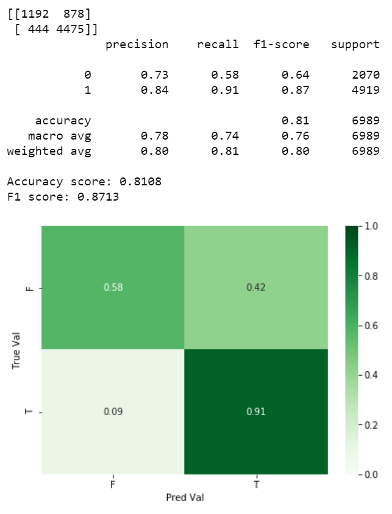

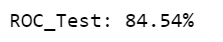

We can see how imbalanced the confusion matrix is though, and in practice, a whip who was using this product would
assume the votes were there too often, when they actually weren't. So I raised the threshold for a yea vote to .9, and
the matrix shifts as such

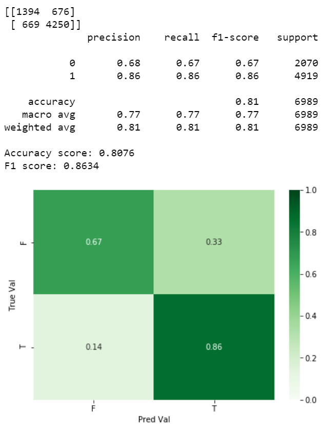

while it lowers our F1 score slightly, the more balanced classes are better served in the eventual product, though we
keep the same ROC score as before

## Creating artifacts for the web application

I then run the entire dataframe through the model, and append the predictions from the model onto the main dataframe, 
for faster retrieval of information in the web app, and save that df as an artifact. I also save the features, scalar, 
and model as .sav files, which will eventually be hosted on AWS for retrieval when creating a sagemaker docker container 
for predictions.

## Building a web app front end (and containerizing)

There are two main containers that I built to present this model to the world. One is the front end web application 
(what's in the web_app folder) that is built using streamlit and allows a user to either: 
1. See how the model compares against how the actual vote went for that bill or
2. Create a new proposed bill (adding in summary information as well as how many cosponsors of each party are on the bill)

The main.py file initializes the sidebar and creates a session state (the class also defined in the main.py file) 
based on the user's choice of which part of the application they want to view (new bills or old bill comparison). This
session state allows the sidebar to persist with the same entry fields throughout the building process for a new proposed
bill. Once the new or old bill direction is chosen, the main file calls the new_bill_search or old_bill_search function
(respectively) that exist in their own python files.

If working with an old bill, it starts by initializing a DataframeHandler object, which is the backend workhorse for 
parsing which congresses are available to view, and what bill numbers exist in that congress to view votes for.
The user chooses which congress they want to view (anything from the 113th to the 116th
congress) and which bill from that congress they want to view a comparison for. Once the "Bill Look Up" button is
pressed, the DataframeHandler object pulls out the information for that specific bill, displays the top line metrics for
how the model compares against reality, and plots the predicted likelihood of a vote against each senator's DW 
nominate score (which is roughly a score on how liberal or conservative a congressperson is, more info here: 
https://en.wikipedia.org/wiki/NOMINATE_(scaling_method)). 

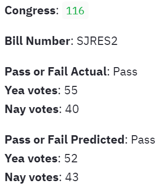

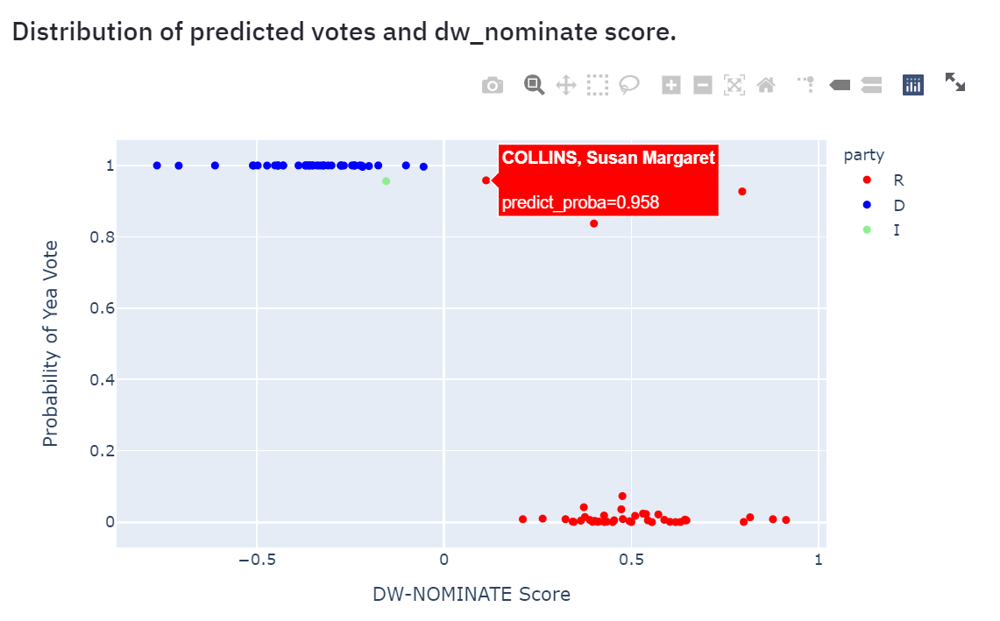

If working with a new proposed bill, we still initialize a DataframeHandler object so that we know which senators from
which Congress we want predictions for. The user is asked to enter pertinent information (a summary of the proposed
bill, and the number of cosponsors from each party, as well as independents) before the information is compiled and
sent to a Sagemaker endpoint on AWS. That endpoint (expanded on below) creates the calculated fields it needs from the
user passed data, and returns a json object, which is parsed into a dataframe and output into human language voting
metrics and graphed for a visualization of where each senator lands on their predicted vote probability.

## Building a sagemaker backend on AWS


## Getting the app hosted and running on AWS Servers

